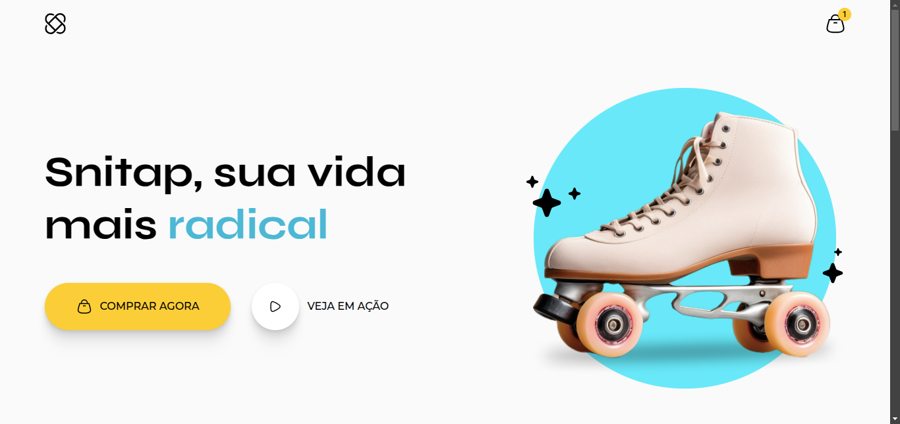

<h1 align="center">✨🛼 Snitap 🛼✨</h1>

> Formação Full-Stack: Avançando no HTML e CSS: Animações e Transições.

O projeto é uma landing page com animações, criada para divulgar um produto específico: patins! 🛼

[🔗 Clique aqui para acessar](https://fel1324.github.io/Snitap/)

## 🤖 Tecnologias

- HTML
- CSS
- Git e Github

## 💚 Contato

rafael.roberto200618@gmail.com

---

Feito com ♥ by Rocketseat :wave: [Participe da nossa comunidade!](https://discord.gg/rocketseat)